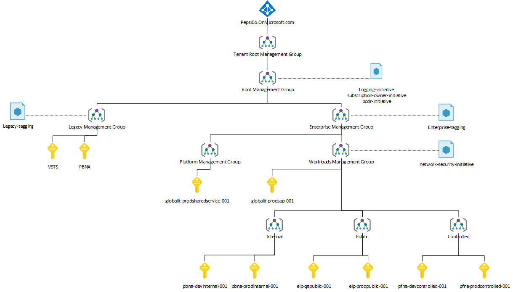
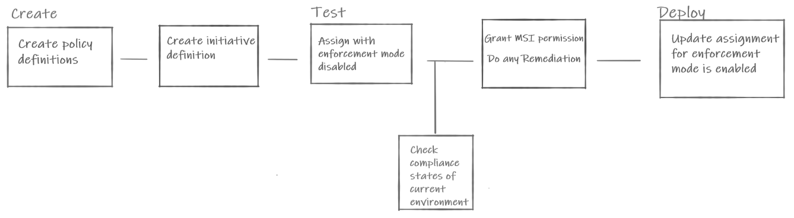

# Custom policy initiatives sample

These policies are intended to work with a management group structure similar to the following:

## Deployment

A sample deployment file, `deploy.sh` is provided in the [Management Group Templates](./armTemplates/managementGroupTemplates) folder. This script will deploy the policies to the management groups and will create an assignment.

## Enforcement Mode

The recommended workflow of policy-as-code looks like the following:

The sample script sets the enforcement mode as disabled by default. This can be changed later in the portal by editing the assignment and changing the **Policy Enforcement** switch to **Enabled**. 